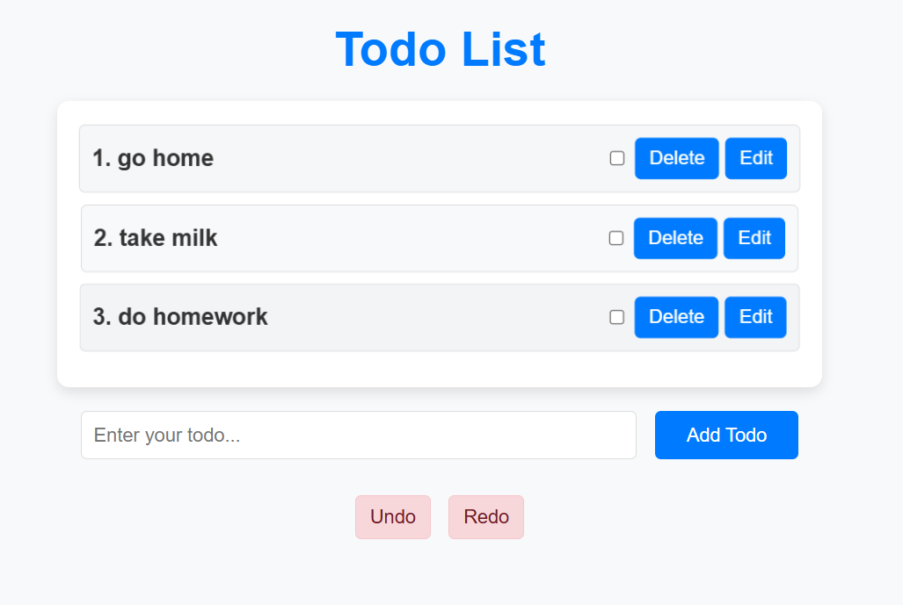

# Todo List Web App

This is a simple Todo List web application built using HTML, CSS, and JavaScript. It allows users to manage their tasks by adding, editing, marking as complete, and deleting them. The app also includes undo and redo functionality for deleted tasks.

## Features
- Add new tasks
- Edit existing tasks
- Delete tasks with undo/redo functionality
- Mark tasks as completed
- Persist data using `localStorage` to keep tasks even after page reloads

## Demo

Here is a screenshot of the app:



### Video Demo:
You can watch a demo of the application in action by clicking the link below:

<video width="320" height="240" controls>
  <source src="assets/demo.mp4" type="video/mp4">
  Your browser does not support the video tag.
</video>


---

### Steps to Run the Project:

1. Clone the repository:

   ```bash
   git clone https://github.com/your-username/Todo_List.git
